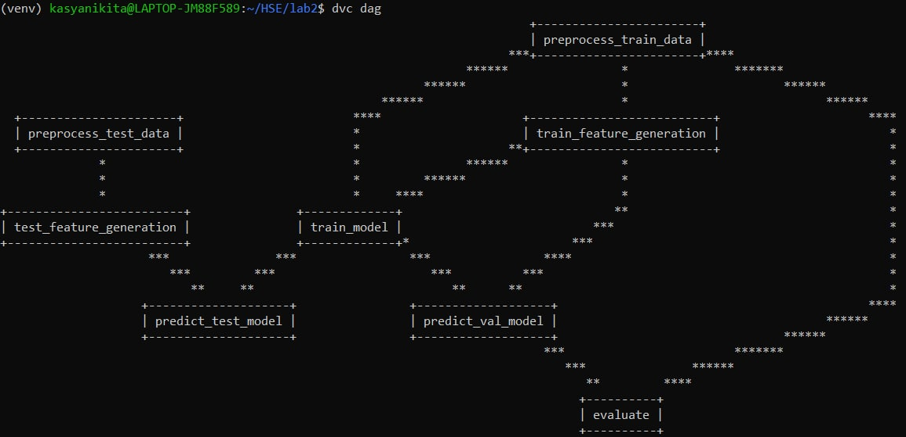
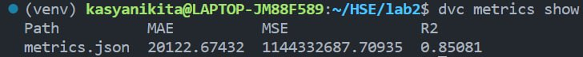
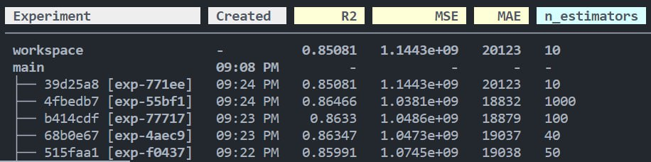

# DataAnalysisRegressionLab

Выполнили студенты 19ПМИ-1:
* **Никита Касьянов**
* **Егор Бузанов**

## Pipeline
Весь пайплайн прописан в _dvc.yaml_.

## Experiments and metrics
В качествеве основной метрики была выбрана ..., так как. В качестве модели был выбран StackingRegressor на основе моделей LinearRegression и Catboost, в качестве финальной модели была выбрана модель RandomForestRegressor, в котором с помощью dvc можно задавать параметр n_estimators. Параметр находятся в файле _params.yaml_ . Один парметр был взят в качестве примера. Ниже приведены примеры запусков различных экспериментов и их метрики.

